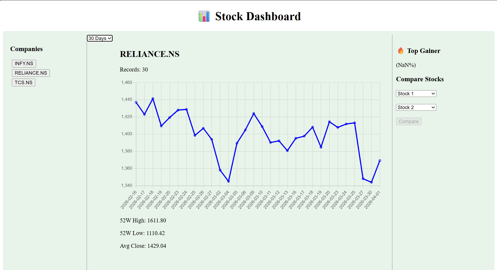

# 📊 Stock Intelligence Dashboard

## 🚀 Project Overview
This project is a full-stack stock analysis dashboard that allows users to view stock trends, analyze key metrics, and compare company performance.

## 🧠 Features
- Real-time stock data using yfinance
- Data cleaning and preprocessing with Pandas
- Metrics:
  - Daily Return
  - 7-day Moving Average
  - 52-week High/Low
- REST APIs using FastAPI:
  - /companies
  - /data/{symbol}
  - /summary/{symbol}
  - /compare
- Interactive UI using React + Chart.js
- Compare two stocks with trend analysis

## 🛠 Tech Stack
- Backend: FastAPI (Python)
- Data Processing: Pandas, NumPy
- Frontend: React (Vite), Chart.js

## ▶️ How to Run

### Backend

uvicorn app.main:app --reload

### Frontend

npm install
npm run dev

## 📈 Insights
- Moving averages help identify trends
- Volatility shows price fluctuation
- Comparison highlights better-performing stocks

## 🔮 Future Improvements
- Add stock prediction model
- Deploy to cloud
- Improve UI design

